# Nébula

<p align="center">
  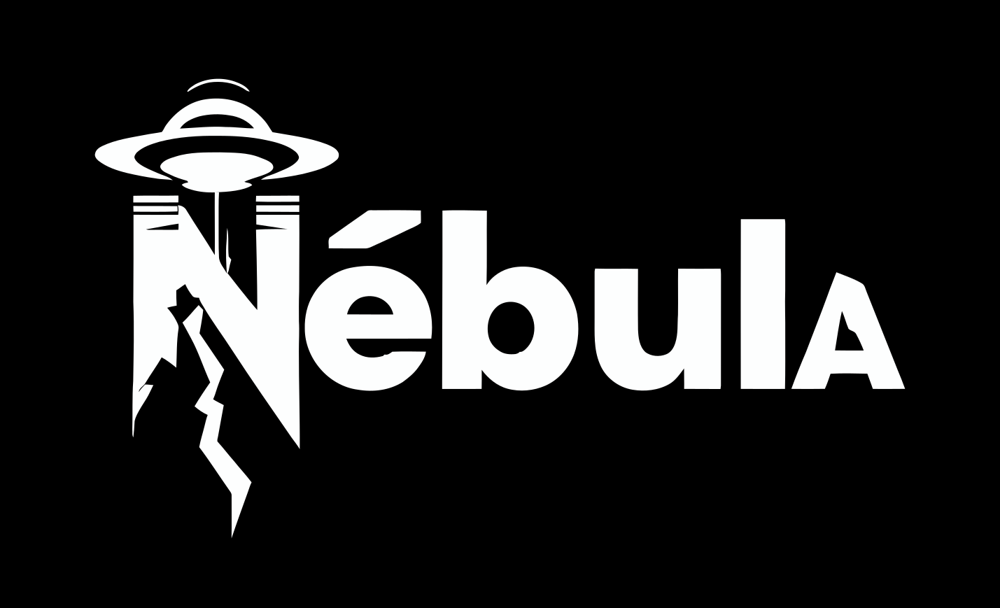
</p>

<p align="center">
  <strong>Editor de imágenes Científico-Técnico</strong>
</p>

Nébula es un editor de imágenes con estilo de instrumento científico/astronómico. Aplica filtros creativos, superposiciones de cuadrícula tipo telescopio y metadatos simulados (coordenadas polares, separación angular, parámetros espectrales) para transformar imágenes en visualizaciones de aspecto técnico-profesional.

---

## Características

- **9 ajustes de imagen**: Brillo, Contraste, Saturación, Tono, Nitidez, Gamma, Temperatura, Vibrancia, Exposición
- **16 estilos creativos**: Sepia, CRT, Térmico, Noir, Cyberpunk, Vaporwave, Dorado, Hielo, Pastel, Mate, Negativo, Neón, Duotono, Tritono, Personalizado, Transmisión Alienígena
- **5 estilos de metadatos**: HUD Alienígena, Minimal, HUD Científico, Placa Astronómica, Geométrico
- **Cuadrícula científica**: Ejes, marcas de graduación, puntos cardinales (N/S/E/W), leyendas
- **Modo pantalla completa** con interfaz obscura 
- **Colores de texto y cuadrícula** adaptativos por estilo
- **Selector de color** (barra de matiz, campo SV, sliders RGB, entrada hex, 32 colores predefinidos)
- **Deshacer/Rehacer** (50 niveles)
- **Atajos de teclado** completos

---

## Dependencias

```
opencv-python>=4.8.0
numpy>=1.24.0
Pillow>=10.0.0
```

Instalación:

```bash
pip install -r requirements.txt
```

---

## Uso

```bash
python main.py
```

O ejecutando `ejecutar.bat` en Windows.

### Atajos de teclado

| Tecla        | Acción                    |
|-------------|---------------------------|
| `Escape`    | Cerrar aplicación         |
| `Ctrl+O`    | Abrir imagen              |
| `Ctrl+S`    | Guardar imagen renderizada |
| `Ctrl+Z`    | Deshacer                  |
| `Ctrl+Y`    | Rehacer                   |
| `Ctrl+R`    | Restablecer todo          |
| `Ctrl+Q`    | Salir                     |

### Formatos soportados

- **Carga**: PNG, JPG/JPEG, BMP, TIFF
- **Guardado**: PNG, JPG

---

## Estilos Creativos

### Sepia (`sepia`)
Analisis Sepia Desaturado y Polvoriento

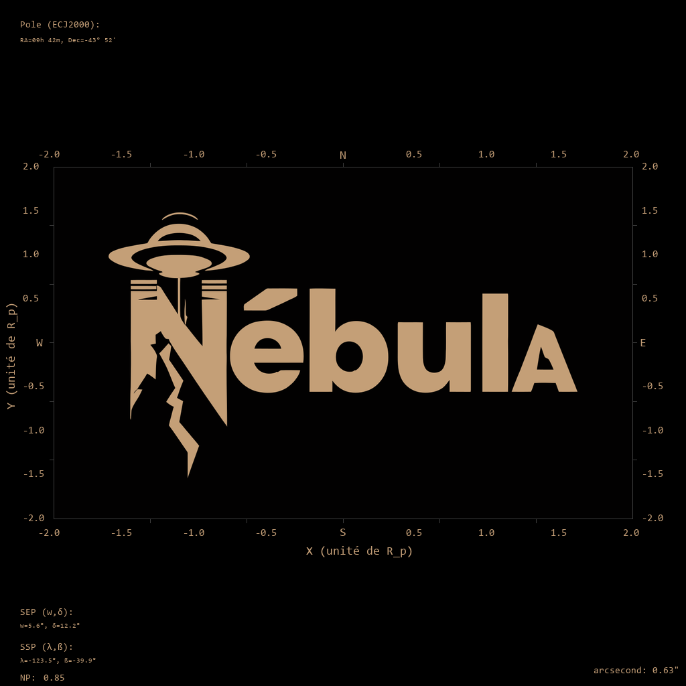

**Algoritmo:** Escala de grises + tinte sepia.

```math
g = \frac{R + G + B}{3}, \quad
\begin{bmatrix}R' \\ G' \\ B'\end{bmatrix} = (1 - i) \cdot \begin{bmatrix}R \\ G \\ B\end{bmatrix} + i \cdot g \cdot \begin{bmatrix}t_R/255 \\ t_G/255 \\ t_B/255\end{bmatrix}
```

Donde $`i`$ es la intensidad y $`t`$ el color sepia configurable.

---

### CRT (`crt`)
Visualizacion CRT Analogica Retro

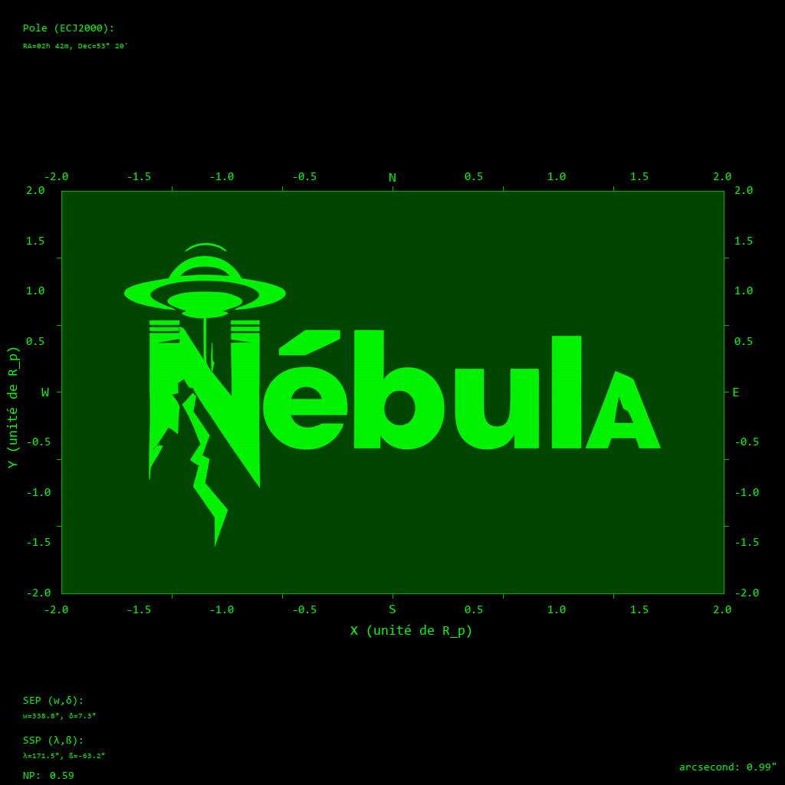

**Algoritmo:** Corrección gamma, fósforo monocromo o color, scanlines, bloom y distorsión barrel.

**Gamma del fósforo:**
```math
\gamma_{out} = \gamma_{in}^{1/2.2}
```

**Scanlines (multiply cada N filas):** Obscurece periódicamente filas de píxeles para simular las líneas horizontales visibles en monitores CRT antiguos.
```math
M(y) = \begin{cases} 1 - i_s & \text{si } y \bmod paso < alto \\ 1 & \text{cc} \end{cases}, \quad
RGB' = RGB \cdot M
```

**Distorsión barrel (curvatura):**
```math
r^2 = \left(\frac{x - c_x}{c_x}\right)^2 + \left(\frac{y - c_y}{c_y}\right)^2, \quad
s = 1 + k \cdot r^2, \quad
(x', y') = \text{remap}(x \cdot s, y \cdot s)
```

---

### Thermal (`thermal`)
Escaner de Vision Termica o Espectral

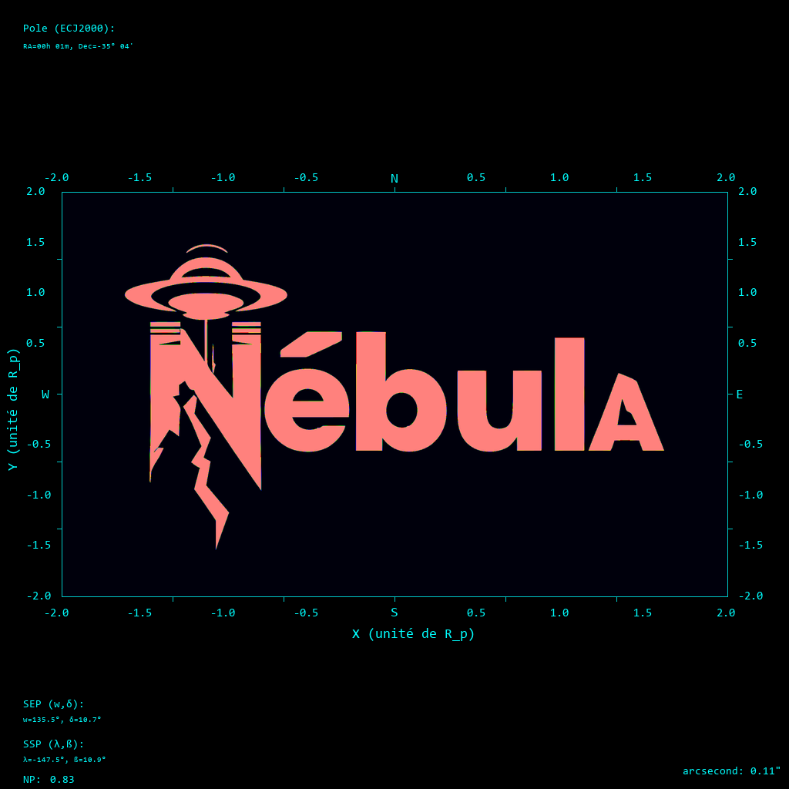

**Algoritmo:** Mapeo de grises a paleta de color mediante LUT de 4 segmentos piecewise-linear.

```math
g \in [0, 1] \rightarrow
\begin{cases}
(0, 0, g/0.25) & g < 0.25 \\
(0, t, 1-t) & 0.25 \le g < 0.5,\; t = (g-0.25)/0.25 \\
(t, 1-t, 0) & 0.5 \le g < 0.75,\; t = (g-0.5)/0.25 \\
(1, 1-0.5t, 0.5t) & g \ge 0.75,\; t = (g-0.75)/0.25
\end{cases}
```

También soporta colormaps de OpenCV: `COLORMAP_INFERNO`, `PLASMA`, `VIRIDIS`, `JET`.

---

### Noir (`noir`)
Cine Noir

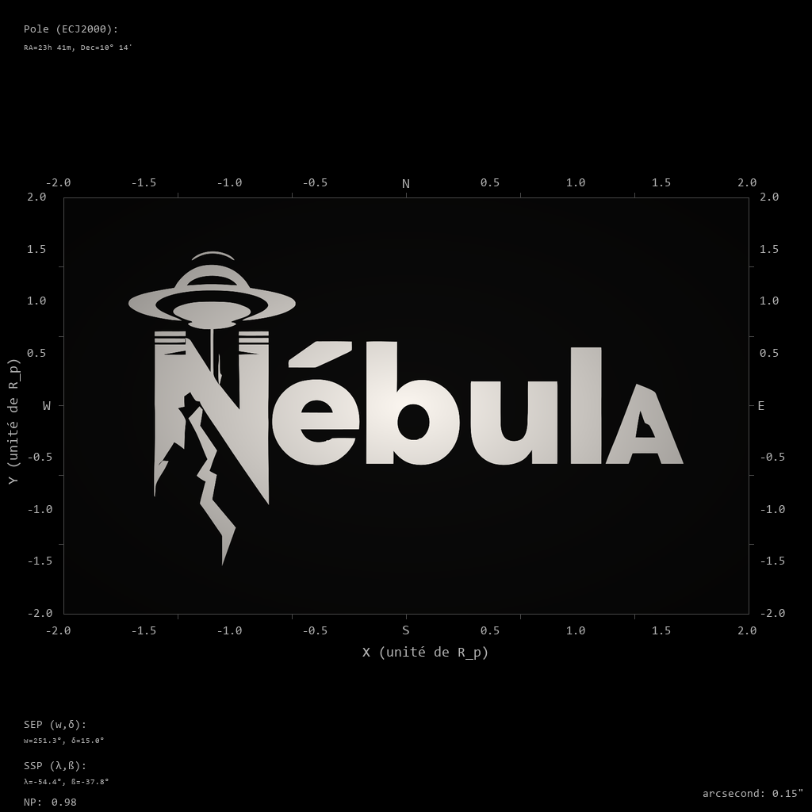

**Algoritmo:** Contraste gain-offset, tinte monocromo, grano y viñeta.

```math
g' = \text{clip}((g - 50(2 - c)) \cdot c + 50 \cdot b, \; 0, 255)
```

Donde $`c`$ es contraste y $`b`$ brillo. Tinte por canal:
```math
[t_R, t_G, t_B] = [0.92, 0.95, 1.00] \cdot (1-t) + [1.05, 0.98, 0.88] \cdot t
```

---

### Cyberpunk (`cyberpunk`)
Cyberpunk Neon

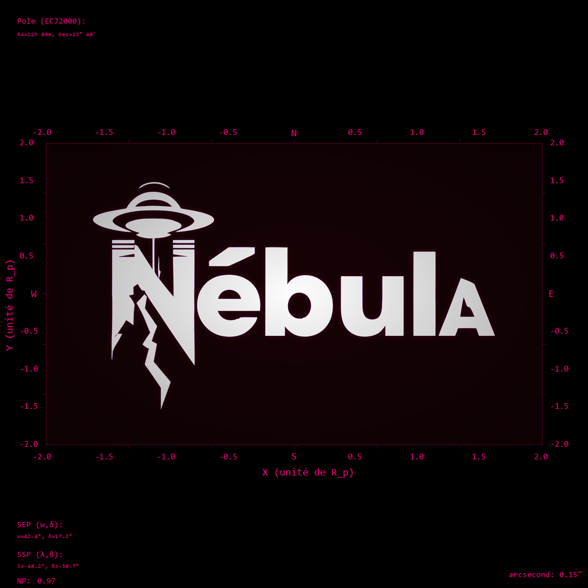

**Algoritmo:** Matriz de mezcla RGB + bloom + scanlines + viñeta.

**Matriz de color 3×3:**
```math
\begin{bmatrix}R' \\ G' \\ B'\end{bmatrix} =
\begin{bmatrix}0.8 & 0.1 & 0.1 \\ 0 & 0.4 & 0.6 \\ 0 & 0 & 1.6\end{bmatrix}
\cdot \begin{bmatrix}R \\ G \\ B\end{bmatrix} + \begin{bmatrix}20 \\ 0 \\ 0\end{bmatrix}
```

**Bloom:** Umbral de luminancia → máscara → Gaussian blur → suma aditiva. Detecta zonas brillantes, las difumina y las reinyecta en la imagen para generar halos luminosos.
```math
m = g > P_{100-t}, \quad bloom = \text{GaussianBlur}(img \cdot m), \quad resultado = img + bloom \cdot i
```

---

### Vaporwave (`vaporwave`)
Vaporwave Retro

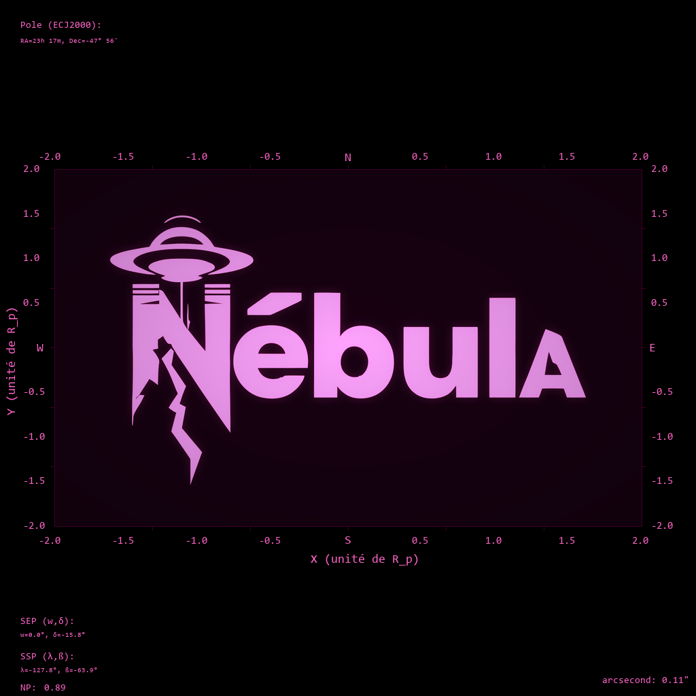

**Algoritmo:** Síntesis rosa/cian desde gris + bloom + fade desaturación + viñeta.

**Síntesis de canales:**
```math
R' = \text{clip}(g \cdot 0.9 + 30, \, 0, 255), \quad
G' = g \cdot 0.5 + original_G \cdot 0.3, \quad
B' = \text{clip}(g \cdot 0.7 + 40, \, 0, 255)
```

**Fade:** $`resultado = resultado \cdot (1 - 0.5f) + gris \cdot 0.5f + 15f`$

---

### Gold (`gold`)
Dorado Metalico

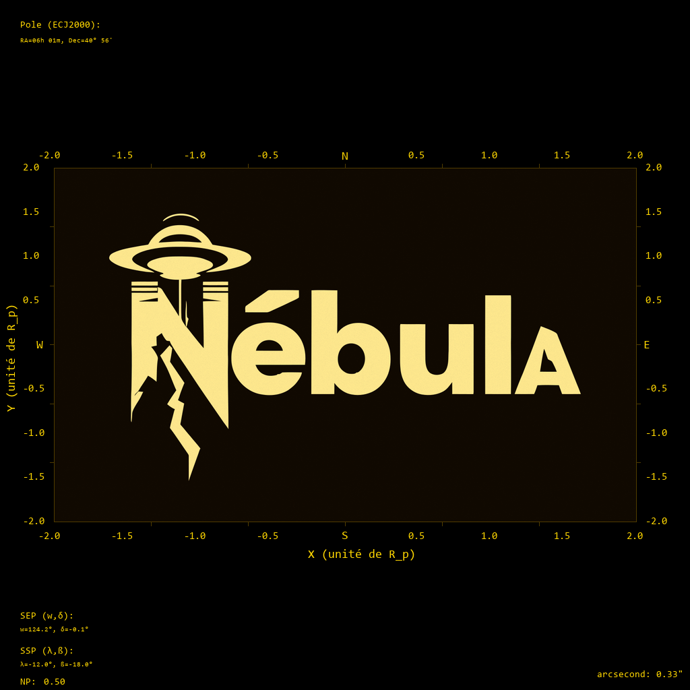

**Algoritmo:** Tono dorado/plateado + mapa de brillo metálico (sheen) + destellos aleatorios.

**Color base:** $`canal = g \cdot t_{canal}/255 + bias`$

**Sheen metálico:**
```math
s = \text{clip}((\text{randn} \cdot 0.15 + g/255 \cdot 0.5 + 0.3 - 0.5) \cdot 2, \; 0, 1)
```

**Destellos (sparkle):** $`m = \text{rand} > 1 - s_f \cdot 0.02`$, luego $`RGB[m] += v \cdot 120`$

---

### Ice (`ice`)
Hielo Azul

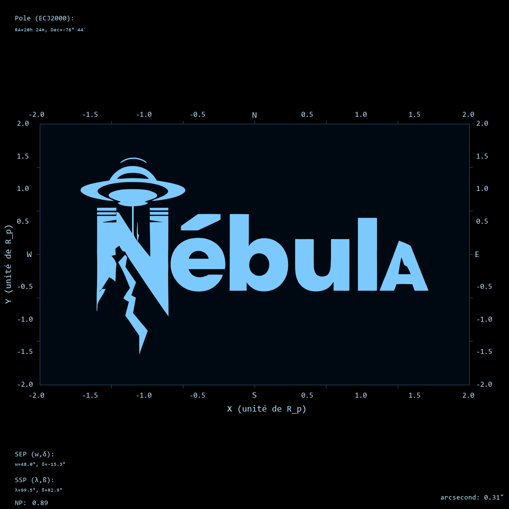

**Algoritmo:** Tono cian/violeta + textura de escarcha + destellos de hielo.

**Interpolación de tono:** $`t = cyan \cdot (1-\tau) + purple \cdot \tau`$

**Escarcha:** $`ruido = \text{clip}(\text{randn} \cdot f \cdot 0.008, \, 0, 1)`$, $`R += ruido \cdot 60`$, $`B += ruido \cdot 20`$

---

### Pastel (`pastel`)
Pastel Suave

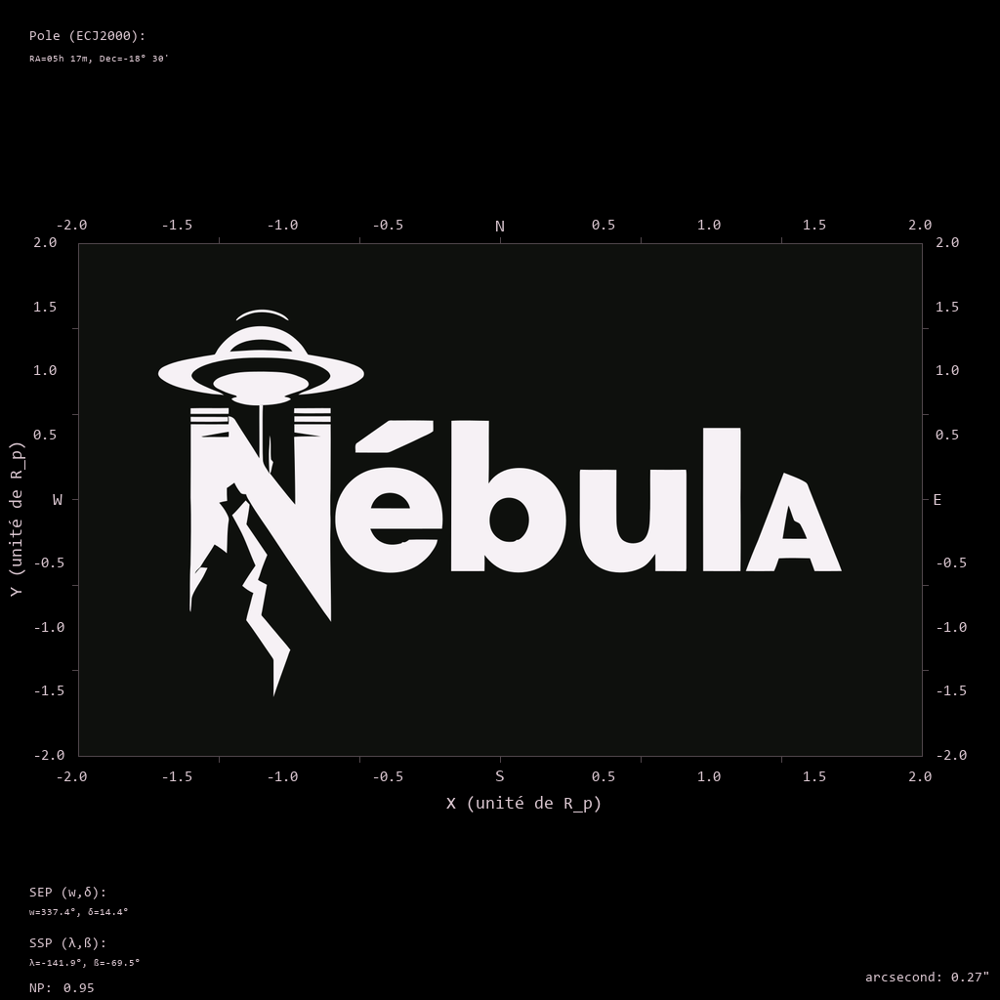

**Algoritmo:** Tono cálido/frío + reducción de saturación + glow difuso.

**Desaturación:** $`resultado = resultado \cdot s + gris \cdot (1-s)`$

**Glow:** $`resultado = \text{clip}(resultado + \text{GaussianBlur}(resultado) \cdot i, \, 0, 255)`$

---

### Muted (`muted`)
Fotografia Mate

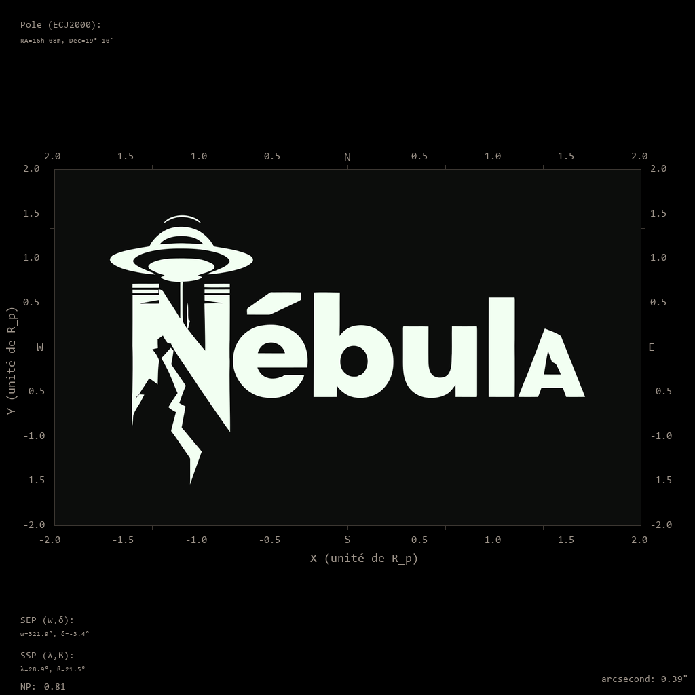

**Algoritmo:** Fade a gris + contraste + temperatura + grano.

**Fade:** $`resultado = original \cdot (1-0.6f) + gris \cdot 0.6f + 20f`$

**Contraste:** $`out = in \cdot (1+c) - 128c`$

**Temperatura:** $`R' = R \cdot w_r`$, $`B' = B \cdot w_b`$ donde $`w_r \in [0.9, 1.0]`$, $`w_b \in [0.9, 1.0]`$

---

### Invert (`invert`)
Negativo

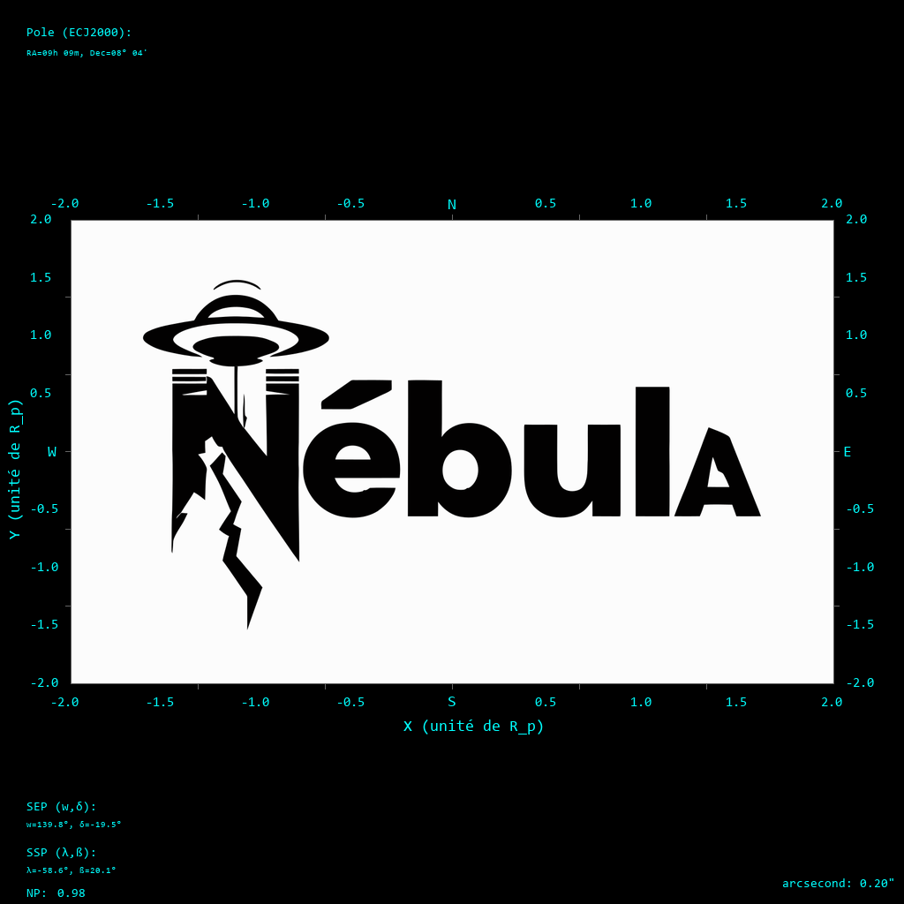

**Algoritmo:** 4 modos de inversión.

- **Completo:** $`RGB' = 255 - RGB`$
- **Luminancia:** $`RGB' = 0.3 \cdot RGB + 0.7 \cdot (255 - g)`$
- **Selectivo:** $`RGB'[g > t] = 255 - RGB[g > t]`$
- **Solarizado:** $`a = 1 - |g - t| \cdot 2`$, $`RGB' = RGB \cdot (1-a) + (255-RGB) \cdot a`$

---

### Neon (`neon`)
Neon Brillante

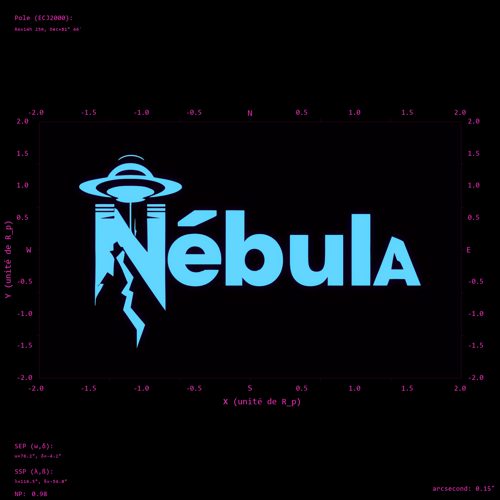

**Algoritmo:** Mapeo dual-color por luminancia + bloom.

```math
g = \text{mean}(RGB)/255, \quad
color = color_1 \cdot (1-g) + color_2 \cdot g
```
```math
RGB' = \text{clip}(g^2 \cdot color \cdot i + RGB \cdot (1-i), \, 0, 255)
```

---

### Duotone (`duotone`)
Duotono

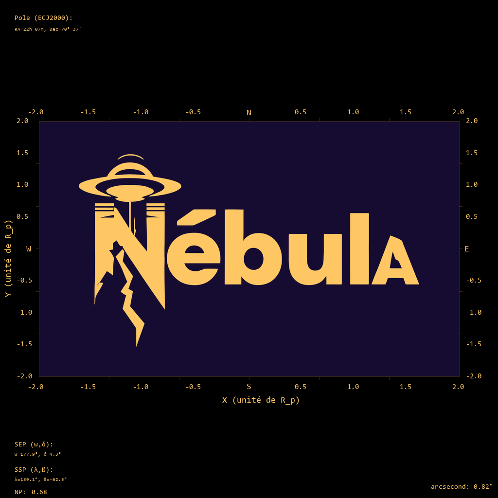

**Algoritmo:** Curva de potencia sobre grises + gradiente bicolor.

**Mapeo de balance:** $`\displaystyle e = \max\left(0.1, \frac{100 - balance}{50}\right)`$, $`g' = g^e`$

**Gradiente:** $`RGB' = (1 - g') \cdot color_{sombra} + g' \cdot color_{destello}`$

---

### Tritone (`tritone`)
Tritono

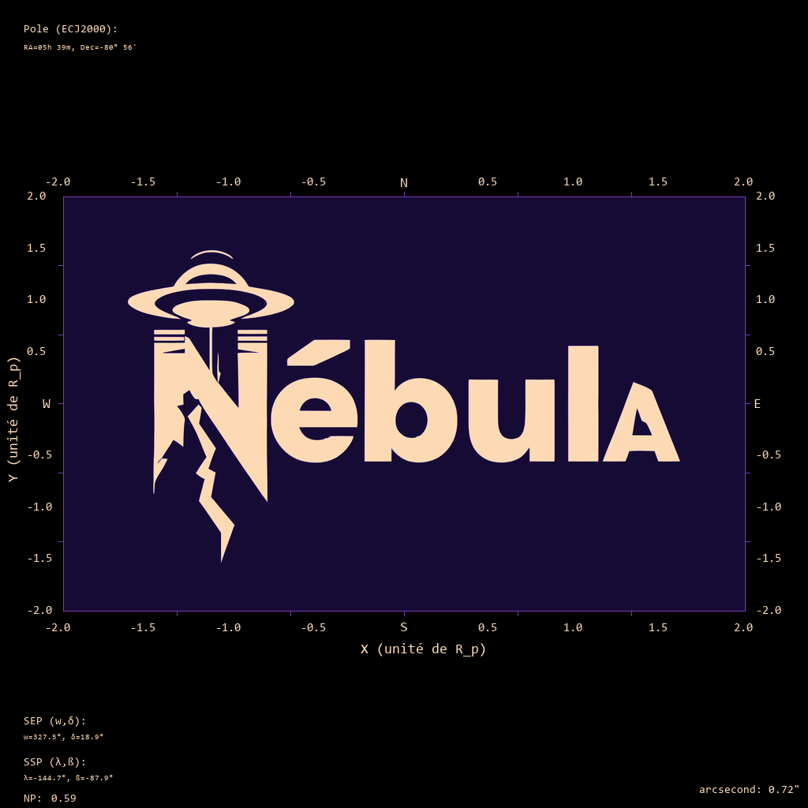

**Algoritmo:** Gradient piecewise-linear de 3 colores sobre grises.

**Punto medio:** $`m = \text{clip}(balance/100, \, 0.05, 0.95)`$

```math
RGB' = \begin{cases}
(1 - g/m) \cdot sombra + (g/m) \cdot medio & g \le m \\[4pt]
(1 - (g-m)/(1-m)) \cdot medio + ((g-m)/(1-m)) \cdot destello & g > m
\end{cases}
```

---

### Alien Signal (`alien_signal`)
Transmision Alienigena

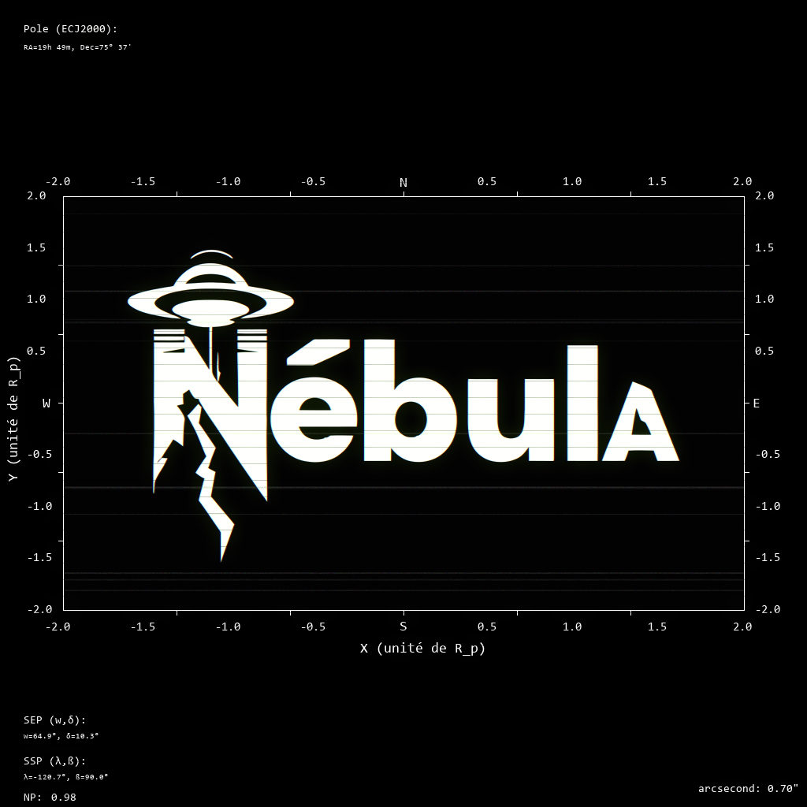

**Algoritmo:** Matriz de deriva de color + aberración cromática + bandas de interferencia + scanlines + resplandor alienígena.

**Deriva de color (matriz 3×3):**
```math
\begin{bmatrix}R' \\ G' \\ B'\end{bmatrix} =
\begin{bmatrix}1-0.6d & 0.3d & 0.3d \\ 0.15d & 1-0.2d & 0.05d \\ 0.3d & 0.15d & 1-0.45d\end{bmatrix}
\cdot \begin{bmatrix}R \\ G \\ B\end{bmatrix}
```

**Aberración cromática:** Desplaza los canales de color para simular errores ópticos o interferencias de transmisión.

$`R' = \text{roll}(R, +s)`$, $`B' = \text{roll}(B, -s)`$

**Bandas de interferencia:** Filas aleatorias reemplazadas por ruido uniforme.

---

### Custom (`custom`)
Personalizado

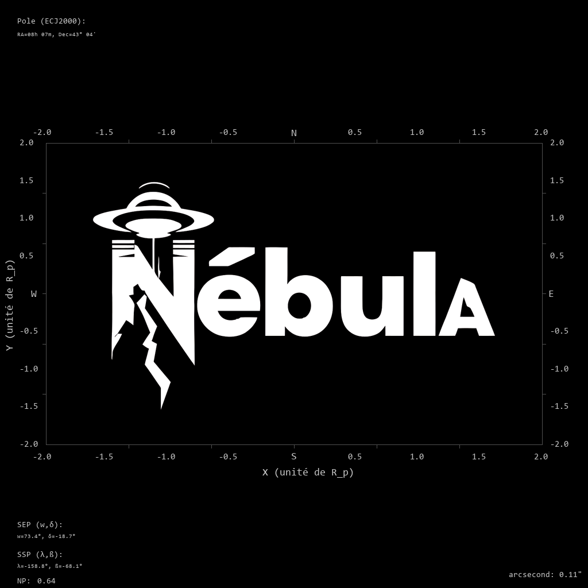

**Algoritmo:** Pipeline multietapa secuencial.

1. **Niveles RGB:** $`c' = \text{clip}((c - black) / (white - black) \cdot 255, \, 0, 255)`$, luego $`\gamma`$: $`c' = (c'/255)^{1/\gamma} \cdot 255`$
2. **Split toning:** $`w_{sombra} = \text{clip}(1 - g(1+b), \, 0, 1)`$, $`w_{destello} = \text{clip}(g(1-b), \, 0, 1)`$
3. **HSL:** $`H' = (H + \Delta_H) \bmod 180`$, $`S' = S \cdot (1 + s/100)`$, $`V' = V \cdot (1 + l/100)`$
4. **Temp/Tint/Vibrance:** $`R \cdot (1 + T/300)`$, $`B \cdot (1 - T/300)`$, $`G \cdot (1 + t/300)`$, $`S' = S \cdot (1 + (v/100) \cdot (1 - S/255) \cdot 0.5)`$

---

## Estilos de Metadatos

### HUD Alienigena (`alien_hud`)
> Panel HUD sci-fi con soportes de esquina, barrido de radar, barra de frecuencia, panel de datos decodificados.

### Minimal (`minimal`)
> Solo texto limpio: coordenadas polares, valores SEP/SSP/NP, etiqueta de arcosegundo.

### HUD Cientifico (`scientific_hud`)
> Paneles de instrumentos con recuadros, rosa de los vientos, barra de progreso NP, barra de escala.

### Placa Astronomica (`astronomical_plate`)
> Look de placa fotográfica vintage con marcas fiduciales, texto grabado con sombras.

### Geometrico (`geometric`)
> Superposición de retícula con indicadores de dial semicirculares para SEP/SSP/NP, barra de escala con marcas.

---

## Interfaz

- **Tema**: Oscuro completo (`#000000` fondo, `#cccccc` texto)
- **Diseño**: Pantalla completa con canvas a la izquierda y panel de controles a la derecha (280px)
- **Canvas**: 1024×1024 píxeles con margen de 80px. La imagen se centra y escala manteniendo aspecto.
- **Controles**: Secciones colapsables, sliders con indicador numérico, selectores de color, comboboxes oscuros personalizados

---

## 📄 Licencia

Este proyecto no especifica una licencia. Todos los derechos reservados.

---

## Desarrollo

### Empaquetado con PyInstaller

El proyecto incluye soporte para `resource_path()` en `utils/__init__.py` que resuelve rutas correctamente tanto en desarrollo como en ejecutable empaquetado.

### Convenciones

- Python 3.10+ con type hints
- Tkinter para UI (sin frameworks externos)
- PIL + OpenCV + NumPy para procesamiento
- Patrón Observer para comunicación UI ↔ Engine
- Singleton para FontManager y StyleManager
